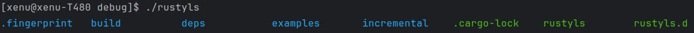

# rustyls
### A simple rusty equivalent to linux's 'ls' command
Created for purpose of learning Rust programming language
## Usage
Just execute the binary like this on Linux: `./rustyls` and you will get a list of all directories and files with
color coding
